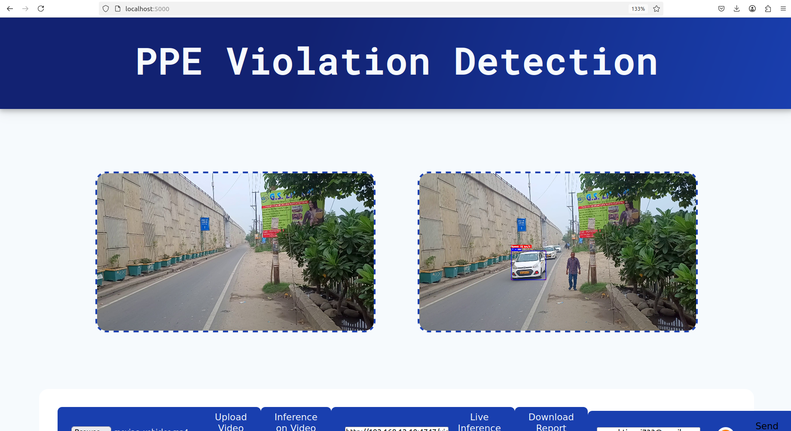

# Intelligent Speed Violation Detection System

## 1. Overview
This project detects vehicle speed and identifies speed violations in traffic videos.  
It uses YOLOv9 for vehicle detection, DeepSORT for tracking, and a simple speed calculation formula based on pixel distance and frame rate.  
A license plate recognition module (ANPR) is included for identifying the violating vehicle.

---

## 2. Features
- Vehicle detection using YOLOv9  
- Multi-object tracking using DeepSORT  
- Speed estimation for each tracked vehicle  
- Automatic violation detection  
- ANPR for reading number plates  
- Works on recorded traffic videos  

---

## 4. How It Works
### Step 1 — Vehicle Detection  
YOLOv9 detects vehicles frame-by-frame.

### Step 2 — Vehicle Tracking  
DeepSORT assigns a unique ID to every moving vehicle.

### Step 3 — Speed Estimation  
Speed is estimated using:
- object movement (pixels)
- frame rate (FPS)
- calibration ratio

### Step 4 — Violation Detection  
If the calculated speed > threshold:  
✔ Mark as violation  
✔ Capture frame   

---

## 5. Running the Project 

```bash
pip install -r requirements.txt
python yolov9/detect_dual_anpr.py --weights best.pt --source demo/input_video.mp4
runs/detect/exp/

```
## Output Image 

<p>
  
</p>


